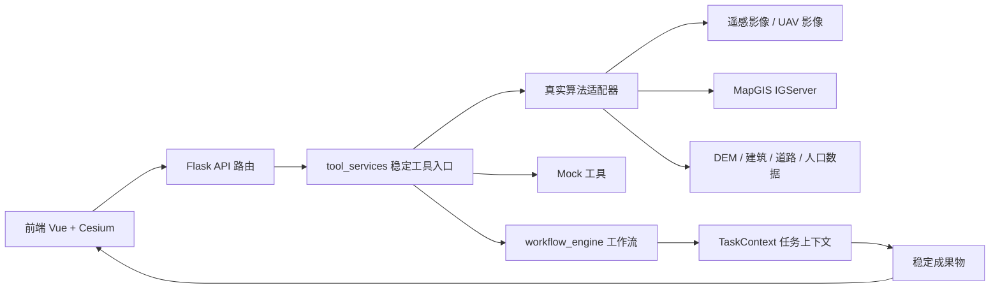

# 翼澜 GIS 系统功能实现与接入路线

> 版本：v0.1
>
> 目的：明确每个待实现功能的算法路径、代码入口、接口字段、联调方式和验收标准。队员可以按照本文档逐项开发，不需要重新设计系统架构。

## 一、当前系统状态

当前系统已经具备：

- Flask 后端和 Vue + Cesium 前端；
- 统一 API 响应格式；
- 五个固定业务场景；
- 工作流编排、任务上下文、成果物登记；
- Mock 数据和 Mock 工具；
- 前后端联调入口；
- 一键启动脚本。

当前仍然需要实现的是真实算法、真实数据源和生产化功能。`backend/services/` 下的若干文件已经提供了接入位置，但其中部分函数仍然是 `NotImplementedError` 占位。

当前默认运行方式：

```text
provider=mock
```

模块完成后再切换为：

```text
provider=real
```

开发阶段也可以使用：

```text
provider=auto
```

`auto` 会优先调用真实模块，失败后回退到 Mock，适合联调和演示；`real` 失败时直接返回错误，适合验收真实功能。

## 二、总体架构与接入原则



必须遵守以下原则：

1. 路由只负责接收请求、调用服务、返回响应，不写算法。
2. 算法放在 `backend/services/` 下，使用独立文件和独立函数。
3. `backend/services/tool_services.py` 是算法和系统之间的适配层。
4. 前端只依赖接口字段和成果物名称，不依赖具体算法名称。
5. 所有空间结果优先使用 GeoJSON，坐标统一转换为 WGS84 / EPSG:4326 后返回前端。
6. 真实算法失败时必须返回统一错误格式，不能直接让异常穿透到前端。
7. 不随意修改 `results`、`artifacts` 和接口响应字段。

## 三、统一接入流程

每个队员实现一个模块，都按照下面的步骤执行：

### 第 1 步：准备输入样例

先在 `backend/data/` 下准备最小可运行样例：

```text
backend/data/
├── sar/          # Sentinel-1 或其他遥感影像
├── uav_images/   # 无人机图片/视频帧
├── dem/          # DEM 地形数据
├── geojson/      # 建筑、道路、行政区等矢量数据
└── models/       # YOLO 或其他模型权重
```

样例数据必须记录：

- 文件名和来源；
- 坐标系；
- 拍摄/获取时间；
- 空间范围；
- 波段或属性说明；
- 许可和使用限制。

### 第 2 步：实现服务模块

在 `backend/services/` 下完成对应算法文件，先保证函数可以单独运行，再接入系统。

### 第 3 步：接入 `tool_services.py`

`tool_services.py` 负责：

- 读取 `provider`；
- 调用真实模块；
- 统一整理返回字段；
- 记录算法名、处理时间和输入信息；
- 在 `auto` 模式下回退 Mock。

### 第 4 步：单模块测试

至少测试：

- 正常输入；
- 文件不存在；
- 坐标系错误；
- 空结果；
- 算法异常；
- 大文件或超时情况。

### 第 5 步：工作流测试

调用：

```http
POST /api/orchestrator/execute
```

例如：

```json
{
  "scenario": "flood_recon",
  "params": {
    "region": "guigang",
    "provider": "real",
    "image_path": "data/sar/guigang_s1.tif"
  }
}
```

### 第 6 步：前端验收

确认前端能够：

- 显示工作流日志；
- 加载 GeoJSON 图层；
- 更新统计指标；
- 更新风险等级和行动建议；
- 对失败、空数据、超时给出提示。

## 四、功能一：SAR 水体/洪水范围提取

### 4.1 目标

从 Sentinel-1 SAR 影像中提取水体或洪水淹没范围，输出淹没区 GeoJSON、面积和置信度。

### 4.2 当前代码入口

```text
backend/services/ndwi_extractor.py
```

当前已有函数：

```python
extract_flood(sar_image_path: str) -> dict
sdwi_index(vv_band, vh_band) -> numpy.ndarray
mask_to_geojson(mask, transform) -> dict
```

当前状态：函数主体仍需要实现。

### 4.3 推荐实现路径

1. 使用 Rasterio 打开 GeoTIFF。
2. 读取 VV、VH 波段，并检查波段数量和 NoData 值。
3. 根据数据类型完成线性值、dB 值转换。
4. 计算 SDWI 或其他水体指数。
5. 使用 Otsu、固定阈值或训练得到的阈值进行分割。
6. 使用形态学开闭运算去除噪声和孔洞。
7. 将栅格掩膜转为面状矢量。
8. 过滤过小斑块，修复无效几何。
9. 计算面积和置信度。
10. 转换为 EPSG:4326 GeoJSON。

### 4.4 推荐返回格式

```json
{
  "geojson": {
    "type": "FeatureCollection",
    "features": []
  },
  "area_km2": 12.5,
  "confidence": 0.87,
  "crs": "EPSG:4326",
  "bounds": [109.5, 23.0, 109.7, 23.2]
}
```

### 4.5 接入现有框架

`tool_services.extract_water()` 会根据 `provider` 调用 `extract_flood()`。建议将适配层统一为既能兼容 GeoJSON，也能接收完整结果：

```python
result = extract_flood(image_path)
if isinstance(result, dict) and "geojson" in result:
    data = result
else:
    data = {"geojson": result}
return success(data, ...)
```

工作流会把结果登记为：

```text
results.water_extract
artifacts.flood_extent
```

### 4.6 验收标准

- 能读取真实 GeoTIFF；
- 无效文件可以返回明确错误；
- 输出合法 GeoJSON；
- 在 Cesium 中可以显示淹没面；
- 面积与 GIS 软件测量结果误差可接受；
- 至少准备一组人工标注范围用于对比 IoU 或面积误差。

## 五、功能二：无人机目标识别

### 5.1 目标

从无人机航拍图像或视频帧中识别人、车辆、建筑、受损设施等目标，并把像素位置转换为空间位置。

### 5.2 当前代码入口

```text
backend/services/color_detector.py
```

当前已有：

```python
detect_by_color(image_path: str) -> dict
detect_by_haar(image_path: str) -> dict
```

目前是颜色检测和 Haar 检测占位，后续可以替换为 YOLO、RT-DETR 或其他模型。

### 5.3 推荐分阶段实现

第一阶段：使用 HSV 颜色分割，快速打通链路。

第二阶段：使用 OpenCV Haar 或轻量目标检测模型。

第三阶段：使用无人机数据集训练或微调 YOLO，增加人员、车辆、房屋、船只等类别。

第四阶段：结合无人机姿态、飞行高度、相机参数和 DEM，将像素坐标转换为经纬度。

### 5.4 推荐返回格式

```json
{
  "geojson": {
    "type": "FeatureCollection",
    "features": [
      {
        "type": "Feature",
        "properties": {
          "class": "person",
          "confidence": 0.91,
          "bbox": [100, 120, 140, 190]
        },
        "geometry": {
          "type": "Point",
          "coordinates": [109.59, 23.06]
        }
      }
    ]
  },
  "counts": {
    "person": 1,
    "vehicle": 2,
    "building": 3
  }
}
```

### 5.5 接入现有框架

`tool_services.detect_objects()` 调用：

```python
from services.color_detector import detect_by_color
result = detect_by_color(image_path)
```

如果以后改为 YOLO，建议新增：

```text
backend/services/yolo_detector.py
```

然后只修改 `tool_services.detect_objects()` 的真实 provider 分支，前端和工作流不改。

结果登记为：

```text
results.object_detect
artifacts.detected_objects
```

### 5.6 验收标准

- 能处理单张图片；
- 能输出类别、置信度和数量；
- 能在地图上显示目标点；
- 无目标时返回空 FeatureCollection，而不是异常；
- 使用带标注的测试集统计 Precision、Recall 和漏检情况；
- 明确说明目标点坐标是精确定位还是估算定位。

## 六、功能三：无人机路径规划

### 6.1 目标

根据起点、目标区、洪水范围、障碍物和禁飞区，生成无人机航线。

### 6.2 当前代码入口

```text
backend/services/path_planner.py
```

当前已有类：

```python
AStarPlanner(grid_size=30)
```

需要实现：

```python
plan(start, goal, obstacles)
plan_coverage(start, coverage_polygon, no_fly_zones)
to_geojson(waypoints)
```

### 6.3 推荐实现路径

1. 读取洪水面、禁飞区和障碍物。
2. 统一坐标系，最好在局部投影坐标系中进行距离计算。
3. 根据范围和网格大小创建二维网格。
4. 将障碍物和禁飞区栅格化。
5. 使用 A* 规划起点到终点路径。
6. 使用牛耕式扫描生成洪水区覆盖航线。
7. 检查航线是否穿过障碍物或禁飞区。
8. 对路径进行平滑、合并和简化。
9. 计算距离、预计时间和覆盖率。
10. 转回 EPSG:4326，输出 GeoJSON LineString。

### 6.4 推荐返回格式

```json
{
  "route": {
    "type": "FeatureCollection",
    "features": []
  },
  "waypoints": [[109.55, 23.05, 150]],
  "total_distance_km": 15.2,
  "duration_min": 42,
  "coverage_rate": 0.85,
  "safe": true
}
```

### 6.5 接入现有框架

`tool_services.plan_path()` 会：

- 有 `coverage_polygon` 时调用 `plan_coverage()`；
- 没有覆盖面时调用 `plan()`；
- 最后通过 `to_geojson()` 生成路线。

结果登记为：

```text
results.path_plan
artifacts.inspection_route
```

### 6.6 验收标准

- 起点和终点正确；
- 航线不穿过禁飞区；
- 路径为合法 GeoJSON；
- 路线可以在 Cesium 中显示；
- 距离和时间计算有明确公式；
- 无可行路径时返回明确错误；
- 至少准备一个含障碍物和禁飞区的测试案例。

## 七、功能四：MapGIS / IGServer 空间分析

### 7.1 目标

将洪水范围与建筑、道路、人口等图层叠置，统计受影响对象，为风险评估和决策报告提供数据。

### 7.2 当前代码入口

```text
backend/services/igs_client.py
```

当前已有：

```python
check_connection()
list_workflows()
overlay_layers(...)
```

`overlay_layers()` 仍然是占位函数。

### 7.3 推荐实现路径

1. 在配置文件或环境变量中配置 IGServer 地址、端口和认证信息。
2. 先实现连接测试和工作流列表查询。
3. 确认 600227 叠置分析工作流的参数格式。
4. 将洪水面和建筑图层上传或注册到 MapGIS 数据库。
5. 调用叠置分析接口。
6. 获取结果图层或统计结果。
7. 必要时下载结果为 GeoJSON，供 Cesium 展示。
8. 统一整理建筑数量、道路长度、人口数量和面积等指标。

### 7.4 推荐返回格式

```json
{
  "stats": {
    "buildings": {
      "count": 38,
      "area_m2": 42000
    },
    "roads": {
      "count": 12,
      "length_km": 4.3
    },
    "population": {
      "count": 1200
    }
  },
  "result_layer": "gdbp://.../flood_affected"
}
```

### 7.5 接入现有框架

`tool_services.overlay_layers()` 负责调用：

```python
igs_client.overlay_layers(
    layer1_gdbp,
    layer2_gdbp,
    over_type=over_type,
    result_gdbp=result_gdbp,
)
```

路由仍然使用：

```http
POST /api/gis/overlay
```

结果登记为：

```text
results.gis_overlay
artifacts.affected_stats
```

### 7.6 验收标准

- 可以检测 IGServer 是否在线；
- 可以成功调用一次 600227 工作流；
- 叠置结果与 MapGIS 客户端结果一致；
- 统计结果可以被风险评估使用；
- IGServer 不可用时能返回清晰错误，不影响 Mock 模式运行。

## 八、功能五：空间统计与风险评估

### 8.1 空间统计

当前入口：

```text
backend/services/tool_services.py
aggregate_stats()
```

它会汇总：

- 淹没面积；
- 航线长度；
- 航线预计时间；
- 目标数量；
- GIS 叠置统计。

接入真实模块后，需要把默认值替换为真实结果，并处理字段缺失、空结果和单位换算。

### 8.2 风险评估

当前入口：

```text
backend/services/tool_services.py
assess_risk()
```

当前是可解释规则：

```text
发现人员目标 + 淹没面积较大 + 受影响建筑较多
                ↓
        风险等级和行动建议
```

推荐分三步实现：

1. 先完成可解释规则和阈值配置。
2. 用历史案例或模拟案例校准阈值。
3. 如果数据足够，再引入模型或专家评分。

必须保持输出字段：

```json
{
  "risk_level": "high",
  "reasons": ["发现1名人员目标", "淹没面积较大"],
  "recommended_action": "优先规划人员目标巡检航线",
  "confidence": 0.75
}
```

结果登记为：

```text
artifacts.risk_assessment
artifacts.decision_metrics
```

验收重点不是“模型多复杂”，而是风险结论能够解释、复现，并且与统计结果一致。

## 九、功能六：洪涝态势推演

### 9.1 当前状态

当前 `simulate_gis()` 只是返回模拟水位和提示信息，还没有真实 provider 分支。

### 9.2 推荐实现路径

1. 先确定推演目标：水位变化、淹没范围扩展，还是道路中断预测。
2. 准备 DEM、河网、历史水位、降雨或水文数据。
3. 选择简化模型，先实现可演示的二维扩散或水位阈值模型。
4. 输出多个时间点的洪水范围。
5. 生成时间轴或时间字段，供前端播放。
6. 再考虑接入更复杂的水动力模型。

### 9.3 建议新增文件

```text
backend/services/flood_simulator.py
```

建议接口：

```python
simulate(
    dem_path,
    initial_water_level,
    rainfall=None,
    duration_hours=6,
    interval_minutes=30,
) -> dict
```

### 9.4 建议输出

```json
{
  "times": ["2026-07-31T10:00:00+08:00"],
  "layers": [
    {
      "time": "2026-07-31T10:00:00+08:00",
      "geojson": {},
      "area_km2": 13.1,
      "max_depth_m": 1.8
    }
  ]
}
```

### 9.5 接入方式

在 `tool_services.simulate_gis()` 中增加真实 provider 分支；工作流 `situation_deduce` 不需要改场景名称，只读取新的结果。

前端后续增加：

- 时间轴；
- 播放/暂停；
- 不同时间层切换；
- 水深图例；
- 推演参数面板。

## 十、功能七：决策报告与专题图

### 10.1 当前状态

`generate_report()` 目前只返回 HTML 内容摘要，没有真正生成文件。

### 10.2 推荐实现路径

1. 设计报告模板。
2. 汇总水体、目标、路径、叠置统计和风险结果。
3. 生成 HTML 预览。
4. 生成 PDF 或 DOCX。
5. 生成带图例、比例尺、指北针和数据来源的专题图。
6. 将文件保存到任务目录。
7. 返回可下载地址和文件元数据。

### 10.3 建议新增文件

```text
backend/services/report_service.py
backend/data/reports/
```

### 10.4 推荐输出

```json
{
  "format": "pdf",
  "title": "洪涝应急灾情简报",
  "file_path": "data/reports/task_123.pdf",
  "download_url": "/api/reports/task_123/download",
  "content": {}
}
```

### 10.5 接入方式

在 `tool_services.generate_report()` 中调用 `report_service`。前端只需要读取 `download_url`，不需要了解 PDF 生成过程。

## 十一、功能八：前端真实数据和交互完善

### 11.1 当前状态

前端已经可以：

- 调用工作流接口；
- 显示日志；
- 加载洪水面、航线和目标点；
- 显示统计数据和风险建议。

当前仍需完善：

- 真实数据加载状态；
- 接口失败提示；
- 图层开关；
- 图例联动；
- 任务进度；
- 报告下载；
- 推演时间轴；
- 数据来源和更新时间。

### 11.2 推荐接入方式

前端仍然只调用：

```text
POST /api/orchestrator/execute
GET  /api/orchestrator/tasks/{task_id}
```

不要在前端直接调用每个算法模块。这样可以保证：

- 场景编排集中在后端；
- 算法替换不影响前端；
- 未来改成异步任务时，前端只改任务状态处理。

### 11.3 前端验收标准

- Mock 模式和 Real 模式都能显示；
- 后端未启动时显示明确提示；
- 单个图层加载失败不会导致整个页面崩溃；
- 风险等级颜色和文字一致；
- GeoJSON 结果可以重复刷新；
- 报告按钮能够下载真实文件。

## 十二、功能九：数据管理和任务存储

这是从 Demo 走向完整系统必须补充的基础能力。

### 12.1 建议实现内容

- 任务创建和任务状态持久化；
- 输入文件上传；
- 任务输出目录管理；
- 数据文件元数据；
- 结果版本和算法版本记录；
- 用户操作日志；
- 文件清理和过期任务清理。

### 12.2 建议演进路径

第一阶段使用本地目录：

```text
data/tasks/{task_id}/input/
data/tasks/{task_id}/output/
data/tasks/{task_id}/logs/
```

第二阶段使用 SQLite 保存任务和文件元数据。

第三阶段再根据部署规模替换为 PostgreSQL/PostGIS、对象存储和异步任务队列。

不要在第一阶段直接引入复杂微服务。先把单机闭环跑通。

## 十三、工作流与模块的对应关系

| 场景 | 调用模块 | 最终结果 |
|---|---|---|
| 洪水侦察 | 水体提取 → 路径规划 → GIS 叠置 → 风险评估 → 统计 | 淹没范围、巡检航线、风险建议 |
| 灾情评估 | 水体提取 → GIS 叠置 → 风险评估 → 统计 | 受影响建筑、道路、人口和面积 |
| 无人机巡检 | 路径规划 → 目标识别 → GIS 叠置 → 风险评估 | 目标点、路线和优先级 |
| 态势推演 | GIS 模拟 → GIS 叠置 → 风险评估 → 统计 | 多时刻淹没范围和风险变化 |
| 决策简报 | 统计 → 风险评估 → 报告生成 | HTML/PDF/专题图 |

工作流只调用工具名，不关心工具内部使用的是哪种算法：

```text
water_extract  → flood_extent
path_plan      → inspection_route
object_detect  → detected_objects
gis_overlay    → affected_stats
risk_assess    → risk_assessment
stats          → decision_metrics
generate_report → decision_report
```

## 十四、推荐开发顺序

### 第 0 阶段：环境和数据准备

- 完成一键启动依赖安装；
- 确认 Python 3.11 环境；
- 准备一组 SAR、无人机图片、DEM 和矢量图层；
- 确认所有队员可以运行 Mock 工作流。

### 第 1 阶段：先完成最小真实闭环

推荐顺序：

1. 水体提取；
2. GeoJSON 地图展示；
3. 空间统计；
4. 风险评估；
5. 决策简报。

这一阶段先不追求真实路径规划和复杂模型，先实现：

```text
真实影像 → 淹没范围 → 统计 → 风险 → 页面展示
```

### 第 2 阶段：加入无人机巡检

1. 目标识别；
2. 目标点地图定位；
3. A* 路径规划；
4. 禁飞区约束；
5. 真实巡检航线展示。

### 第 3 阶段：接入 MapGIS

1. IGServer 连接；
2. 工作流调用；
3. 洪水面与建筑叠置；
4. 统计结果对比；
5. 结果图层回传 Cesium。

### 第 4 阶段：态势推演和生产化

1. DEM 和水位模拟；
2. 时间轴展示；
3. 任务存储；
4. 报告文件下载；
5. 权限、日志和部署。

## 十五、团队分工建议

### A：算法与后端

负责：

- `ndwi_extractor.py`；
- `path_planner.py`；
- `color_detector.py` 或 YOLO 适配；
- 风险规则和算法测试。

交付标准：每个模块都有独立测试脚本、样例输入、结果截图和字段说明。

### B：前端与三维

负责：

- Cesium 真实图层；
- 图层开关和图例；
- 加载、错误、空数据状态；
- 推演时间轴；
- 报告下载和页面交互。

交付标准：不修改后端算法逻辑，只依赖接口契约。

### C：数据与 MapGIS

负责：

- SAR、DEM、无人机和矢量数据整理；
- 坐标系和数据元数据；
- `igs_client.py`；
- IGServer 工作流验证。

交付标准：提供数据说明、服务地址、调用参数和一次成功请求记录。

### D：测试、文档与联调

负责：

- 接口测试；
- 工作流回归测试；
- 结果截图和演示材料；
- 任务进度和问题记录；
- 用户手册和部署说明。

交付标准：每个模块都有“输入—处理—输出—异常—截图”五项记录。

## 十六、每个模块的提交清单

队员完成一个模块后，提交以下内容：

```text
□ 算法源码
□ 独立测试脚本或 unittest
□ 至少一份输入样例
□ 一份输出 GeoJSON/JSON 样例
□ 依赖是否需要修改 requirements.txt
□ 接入 tool_services.py 的代码
□ provider=real 的执行记录
□ provider=auto 的回退记录
□ 前端显示截图
□ 已知限制和后续改进点
```

## 十七、统一验收命令

后端语法检查：

```bash
python -m compileall backend
```

Mock 工作流测试：

```bash
cd backend
python -m unittest discover -s tests -v
```

健康检查：

```text
GET http://127.0.0.1:5000/api/hello
```

单个真实工具测试：

```text
POST /api/water/extract
POST /api/path/plan
POST /api/detect/objects
POST /api/gis/overlay
```

全链路测试：

```text
POST /api/orchestrator/execute
scenario=flood_recon
provider=real
```

## 十八、最终完成标准

系统达到可交付状态至少需要满足：

- 一键入口能够完成依赖检查、启动后端和打开前端；
- Mock 模式始终可以运行，用于演示和回归测试；
- 至少一个场景完成真实数据闭环；
- 水体范围、目标点、航线能够在三维地图显示；
- GIS 叠置统计能够被风险评估和报告使用；
- 所有失败都有明确错误提示；
- 结果中记录数据来源、算法名称、处理时间和坐标系；
- 队员新增算法不需要修改其他模块的核心逻辑；
- 能够提供一次从输入数据到报告输出的完整演示。

## 十九、最建议现在开始做的三件事

1. 先让所有队员用 `provider=mock` 跑通五个场景，确认环境和接口都没有问题。
2. 由数据负责人准备一组真实 SAR、无人机图片、DEM 和建筑图层，并写清楚坐标系。
3. 优先实现水体提取，因为它会给路径规划、GIS 叠置、风险评估和前端展示提供共同基础。

完成水体提取后，再按照本文档的顺序逐个接入，不建议多人同时直接修改 `workflow_engine.py` 或前端主页面。

